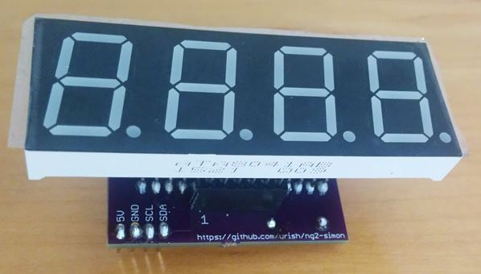
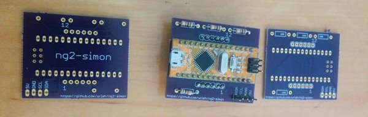

# Serial 20mm 7-Segment Display

A 20mm variation of [Sparkfun's Serial 7 Segment Display](https://www.sparkfun.com/products/11442). 
It was created as part of the [ng2-simon](https://medium.com/@urish/building-simon-with-angular2-iot-fceb78bb18e5) project. 

It exposes a 4-pin connector that allows I2C communication with the display: SDA, SCL, GND, 5V.

## Bill of Materials

* [20mm 7-Segment Display](https://www.sparkfun.com/products/11408)
* [Arduino Nano](http://www.dx.com/p/new-nano-v3-0-module-atmega328p-au-improved-version-for-arduino-yellow-369070)
* [4 100Ω Resistors](https://www.sparkfun.com/products/13761)
* [2 x 6-Pin Female Headers](https://www.sparkfun.com/products/11894) (Optional, you can also solder the 7-segment directly to the PCB)
* [4-Pin 0.1" Connector](https://www.sparkfun.com/products/8231) or simply 4-pin male headers.

## PCB

The PCB was designed from scratch by me. The eagle files are available inside the [pcb](pcb/) folder.
I got mine printed at [Oshpark](https://www.oshpark.com) for 13.4$ per 3 pieces.

## Firmware

The firmware is available in the [firmware](firmware/) folder. 
It was adapter from [Sparkfun's Serial 7-Segment Display Firmware](https://github.com/sparkfun/Serial7SegmentDisplay/tree/master/firmware/Serial%207-Segment%20Display/Serial_7_Segment_Display_Firmware).

## License

All the content in this repository is licensed under the MIT license.
